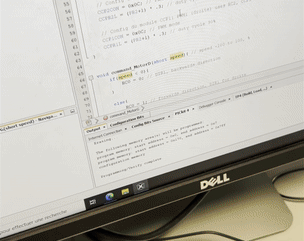

# PIC16F887 Embedded Systems Labs

C programs for the PIC16F887 microcontroller, written for an embedded systems course using the PedagoBot platform. These labs cover basic GPIO; reading pushbuttons and driving LEDs, with all mode and pattern logic handled in software.

## Hardware

- **MCU:** PIC16F887, running at 4 MHz (`_XTAL_FREQ`)
- **LEDs:** PORTB (RB0–RB4)
- **Buttons:**
  - BP1 → RC3 — power / on-off
  - BP2 → RC4 — mode or direction select
- **Toolchain:** MPLAB X IDE with the XC8 compiler
- Both programs `#include "config_bits.h"` for the device configuration bits — make sure that file is present in the project folder before building.

## Programs

| File | Description |
|---|---|
| `led-button-flasher.c` | Flashes a single LED (RB0). BP1 turns the system on/off; while on, BP2 switches the flash rate between 1 Hz and 5 Hz. |
| `led-pattern.c` | Runs a five-LED (RB0–RB4) chasing pattern. BP1 turns the pattern on/off; BP2 switches the running direction (forward/backward). |

Timing in both programs uses software delay loops (`__delay_ms`) rather than hardware timers.

## Setup
 

